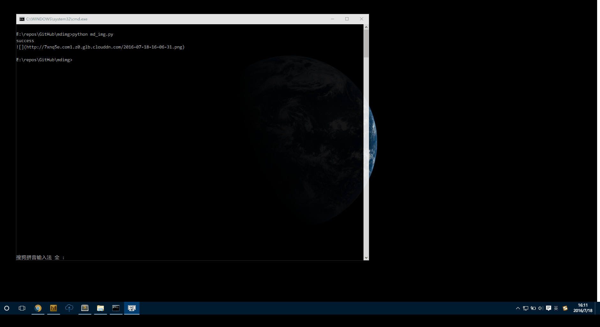

# mdimg
Automatically upload pictures to qiniu cloud storage




# install

## Install directly from the GitHub
```
git clone https://github.com/zhiyue/mdimg
cd mdimg
pip install requirements.txt
```
## windows installtion
download from [realease page](https://github.com/zhiyue/mdimg/releases).


# How to use


## qiniu setting
Obtain relevant information from qiuniu.com

`config.ini`
```
access_key = your-access-key
secret_key = your-secret-key
bucket = your-bucket
domain = your-custom-domain
```

## python 3

```python
python3 md_img.py
```

